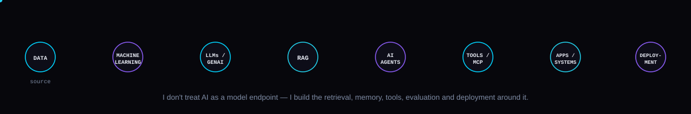
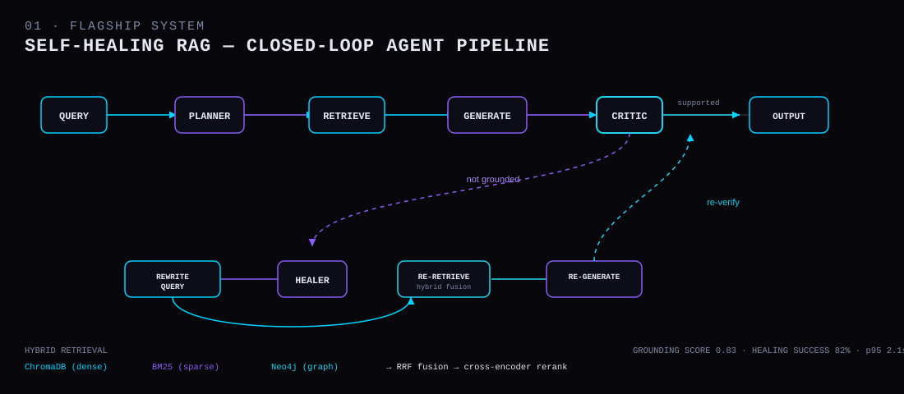
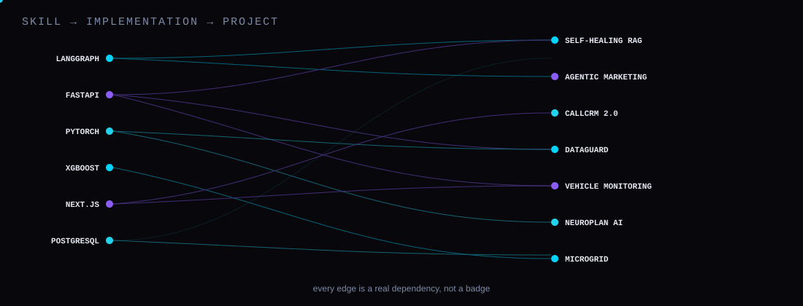

 
  
LinkedIn Email LeetCode

     
WHAT I BUILD
I don't treat AI as a model endpoint. I build systems around models — retrieval, memory, tools, evaluation, orchestration, security and deployment.

  
     
FEATURED SYSTEMS
Seven systems. Not demos — closed loops with evaluation, failure handling and deployment paths behind them.
 
01 · SELF-HEALING RAG
Flagship system
A closed-loop, multi-agent RAG system that evaluates its own answers, diagnoses retrieval failures, and autonomously repairs weak responses before returning them.
Traditional RAG has no feedback loop — a weak retrieval still produces a confident answer. This system closes that loop with a 7-agent LangGraph pipeline: Intake → Planner → Retriever → Generator → Critic → Healer → Output.

  

Retrieval — hybrid dense (ChromaDB) + sparse (BM25) + graph (Neo4j), fused with Reciprocal Rank Fusion and cross-encoder reranking. Retrieval depth adapts to query complexity.
Reliability — claim-level grounding, hallucination detection, 4-way critic routing (FULLY_SUPPORTED / PARTIALLY_SUPPORTED / UNSUPPORTED / CONTRADICTED), prompt-injection detection, audit logging.
Production — auth/RBAC, tenant isolation, rate limiting, Kubernetes deployment, Prometheus + Grafana + OpenTelemetry + LangSmith observability.
Metric	Value
Healing Success Rate	82%
Answer Relevancy	0.92
Context Precision	0.85
Grounding Score	0.83
p95 Latency	2.1s
Development-stage evaluations on a limited dataset — not a production guarantee.
LangGraph FastAPI Next.js ChromaDB Neo4j PostgreSQL Redis Docker Kubernetes RAGAS
VIEW SOURCE →

02 · AGENTIC MARKETING PLATFORM
A governed multi-agent decision system where LLM agents generate and evaluate marketing strategies inside a simulated market, using contextual bandits and off-policy evaluation to gate deployment.
A de-identified thesis release — company-specific data, knowledge base, and brand configuration have been removed.
OBSERVE ─▶ STRATEGIZE ─▶ GENERATE ─▶ VALIDATE ─▶ SIMULATE ─▶ EVALUATE ─▶ GOVERN ─▶ CANARY ─▶ DEPLOY
A campaign isn't Prompt → LLM → Copy. Safety failures route back to regeneration, borderline cases enter human review, and budget violations stop execution outright.
Optimization — LinUCB and Thompson Sampling contextual bandits, evaluated offline with IPS, Direct Method, and Doubly Robust estimation before anything ships.
Simulation — a SimPy market environment with customer agents, competitor agents, and calibrated persona generation across Blog, Email, LinkedIn, and X.
Governance — golden-test gates, claim/competitor validation, cost control, canary rollout. A 16-page Streamlit console covers campaigns, experiments, policy evaluation and deployment.
LangGraph FastAPI pgvector Sentence Transformers Streamlit MLflow Redis/RQ Docker
VIEW SOURCE →

03 · BUILDING ECOSYSTEM CRM — CallCRM 2.0
A domain-heavy CRM and sales operating system built around the real-world workflows of India's building ecosystem.
Current implementation is a high-end real-estate sales OS; the architecture is designed to extend into the wider building ecosystem — construction, architecture, interiors, materials — but that expansion isn't built yet.
PEOPLE · PROPERTY · INVENTORY · RELATIONSHIPS · COMMUNICATION
ACTIVITIES · DEALS · MONEY · DOCUMENTS · OPERATIONS
CallCRM stays the source of truth; integrations run through an event-driven layer:
CALLCRM CORE ─▶ DOMAIN EVENTS ─▶ TRANSACTIONAL OUTBOX ─▶ ASYNC DISPATCHER ─▶ n8n ─▶ EXTERNAL SYSTEMS
HMAC-SHA256 signed events, retries, circuit breakers, inbound idempotency. Sensitive AI-driven CRM changes require human approval.
Real-estate intelligence — property hierarchy (Region → Area → Society → Tower → Floor → Unit), mandate engine with seller price floors, negotiation room, site-visit OS, Indian brokerage/GST/TDS engine, a 100-point buyer/inventory matcher, and a lost-lead resurrector.
83 routes · 239 tests · 28 test suites · Supabase RLS across 39 tables.
Next.js React TypeScript Supabase PostgreSQL Gemini 2.5 Flash n8n Tailwind
VIEW SOURCE →

04 · DATAGUARD
An ML observability platform that turns data-quality, drift and leakage analysis into actionable intelligence.
DATASETS ─▶ QUALITY ─▶ DRIFT ─▶ LEAKAGE ─▶ AI ROOT CAUSE ─▶ HEALTH SCORE
Models can look fine while the data underneath quietly breaks. DataGuard checks for that: Population Stability Index and KS tests for drift, force-directed feature/target graphs for leakage discovery, and a fine-tuned Lily-1.5B model (Unsloth + LoRA) that explains why something's wrong, not just the number.
Heavy computation runs async via Celery + Redis; everything rolls up into a single 0–100 integrity/health score.
FastAPI React TypeScript Celery PostgreSQL SciPy Scikit-learn Unsloth/LoRA
VIEW SOURCE →

05 · AI-POWERED VEHICLE HEALTH MONITORING
A predictive-maintenance platform that uses vehicle telemetry and ML models to estimate failure risk, monitor fleet health, and explain its predictions.
TELEMETRY ─▶ MQTT ─▶ VALIDATION ─▶ ML MODEL ─▶ FAILURE RISK ─▶ SHAP ─▶ HEALTH SCORE ─▶ ALERT
10 telemetry channels — engine temp, oil pressure, coolant temp, RPM, vibration, fuel consumption, battery voltage, tire pressure, speed, engine load — feed five ML classifiers under a champion/challenger registry with automatic promotion. Every prediction ships with a SHAP explanation of which signals drove it, rolled into a composite 0–100 health score.
Next.js FastAPI PostgreSQL MQTT SHAP SQLAlchemy Docker JWT
VIEW SOURCE →

06 · NEUROPLAN AI
An adaptive study-execution engine that models learner progress and reshapes study plans using knowledge tracing, spaced repetition, and a fine-tuned LLM.
LEARNER DATA ─▶ KNOWLEDGE TRACING ─▶ MASTERY ESTIMATION ─▶ LLM PLANNING ─▶ SPACED REPETITION ─▶ ADAPTIVE SCHEDULE
A PyTorch Deep Knowledge Tracing model estimates what a learner actually knows from performance history, drives 1-3-7 spaced revision, and reschedules missed work into future low-density windows instead of just marking it overdue. Planning is handled by a locally fine-tuned LLaMA 3.1 8B (QLoRA, packaged as GGUF).
FastAPI PyTorch LLaMA 3.1 8B / QLoRA PostgreSQL React Zustand
VIEW SOURCE →

07 · INTELLIGENT MICROGRID
An AI-driven energy forecasting system that predicts solar generation and household demand to support smarter battery scheduling and peer-to-peer trading.
Built on a fork of theabhinav0231/Intelligent-Microgrid — forecasting work and metrics below are my contribution, not a claim over the full upstream system.
        STRATEGIC LLM AGENT
          /            \
  BATTERY SCHEDULING   P2P TRADING
          \            /
        FORECASTING ENGINE
          /            \
  SOLAR FORECAST     LOAD FORECAST
     (XGBoost)          (XGBoost)
Model	Data	MAPE	RMSE
Solar forecast	175K rows · 5 cities · 5 yrs (NASA POWER)	2.84%	0.0088 kW
Load forecast	3.28M rows · 75 homes · 5 yrs	13.95%	0.2066 kW
XGBoost NASA POWER PVLib Python
VIEW SOURCE →

ENGINEERING STACK
Skill → implementation → project — not skill → badge.

  
   <table> <tr> <td valign="top" width="33%">
AI / ML Machine Learning Deep Learning NLP · Computer Vision PyTorch · Scikit-learn
GENERATIVE AI LLMs · RAG · Embeddings Vector Search Prompt/Context Engineering Fine-Tuning · QLoRA
</td> <td valign="top" width="33%">
AGENTIC AI Multi-Agent Systems LangGraph Tool / Function Calling Agent Memory Human-in-the-Loop MCP
BACKEND / DATA Python · FastAPI PostgreSQL · Redis Vector Databases · Celery
</td> <td valign="top" width="33%">
FRONTEND TypeScript · React Next.js · Tailwind CSS
INFRASTRUCTURE Docker · Kubernetes AWS · Git Prometheus · Grafana OpenTelemetry
</td> </tr> </table> 
INTELLIGENCE NEEDS TOOLS.
             LLM
              │
            AGENT
              │
             MCP
              │
      ┌───────┼────────┐
      ▼       ▼        ▼
    TOOLS    DATA    SERVICES
MCP provides a standardized way for AI systems to interact with external tools, data sources and services. It's a core part of where my agentic AI work is headed next — orchestration and tool-use are the layer that turns a model into a system.

HOW I THINK ABOUT AI SYSTEMS
A model is not a product. The interesting engineering happens around it.
   MODEL
     +  RETRIEVAL
     +  MEMORY
     +  TOOLS
     +  ORCHESTRATION
     +  EVALUATION
     +  SECURITY
     +  OBSERVABILITY
     +  DEPLOYMENT
     ═  INTELLIGENT SYSTEM

ACTIVITY

   
  
   
LinkedIn Email LeetCode

